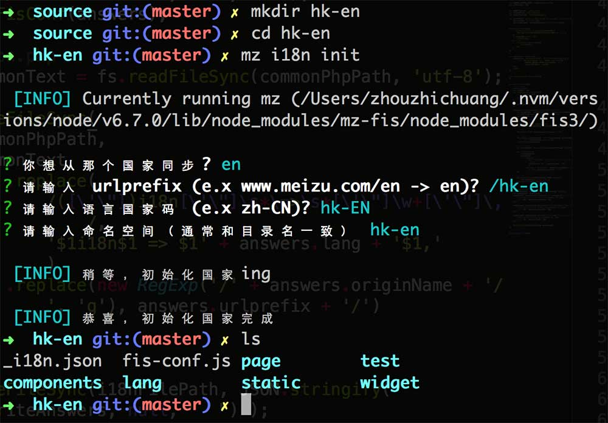
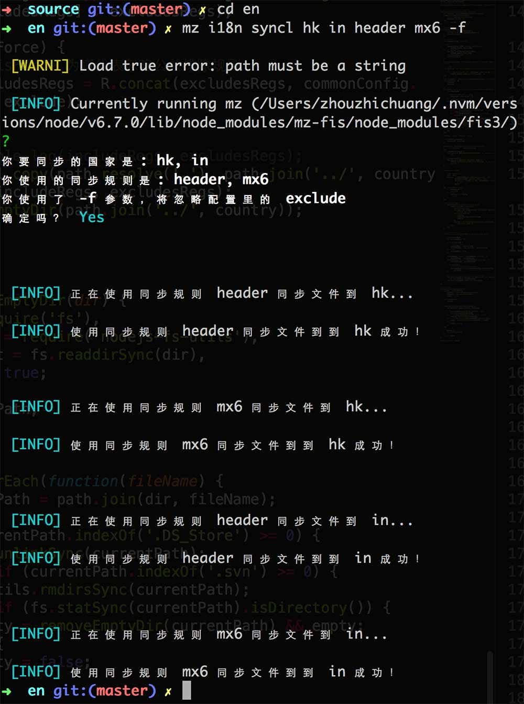

# mz-command-i18n

i18n 命令行工具是一组用于辅助 i18n 项目开发的工具集合。

* init 新建语言版本；
* syncl 在不同语言版本之间同步代码；
* syncs 将运营人员在 i18n 后台的修改同步到本地。

## init 新建语言版本
基于某个已有国家的代码，初始化一个新的国家


#### 用法： 
source 目录下新建语言版本文件夹，进入文件夹 输入 mz i18n init，根据需求回答若干配置问题。

#### 示例：





## syncl 从一个国家同步文件至其他国家

从一个国家同步文件至其他国家，可以为该国家配置同步策略，配置文件为 mz-i18n-config.json，文件使用 glob 来匹配文件。

mz-i18n-config.json 配置说明

```javascript
{
  // 公共排除配置，使用同步规则时，排除的文件。使用 -f 参数将被忽略
  "exclude": [
    "/lang/**",
    "/fis-conf.js",
    "/_publist.ini",
    "/_i18n.json",
    "/static/**/*.custom.*",
    ...
  ],

  // 同步规则
  "rules": {

    // 同步规则，可配置使用该条同步规则时需要同步的文件及针对本条规则的排除文件
    "header": {
      // 如果只有一条 glob 规则，可以直接写字符串
      "include": [ "**/header/**", "**/header.tpl" ],
      "exclude": [ "**/header/images" ]// 若不需要单独定制排除文件，可以省略
    },

    // 同步规则如果不需要单独定制排除文件，可以直接写同步文件
    "pro6": "**/pro6/**"
  }
}
```


#### 用法：
进入某个国家文件夹，输入如下命令
```
mz i18n syncl [country] <rule name> [-f] //(多个国家用 "," 隔开，不能带空格)
```
将当前国家的文件运用某（几）条，同步文件至某（几）个国家

* country: 国家参数，可以同时输入多个国家。不输入国家则代表同步至所有其他国家
* rule name: 必须，可以同时使用多条同步规则
* -f: force 参数，使用此参数将会忽略 mz-i18n-config.json 中的公共排除配置 exclude

#### 示例：

使用 mz-i18n-config.json 中已经配置好的同步规则 `header`、`mx6` 同步国家 en 的文件到国家 hk、in





## syncs 同步线上修改

当项目运营人员在该 i18n 项目后台修改更新了某个页面数据（test下的 php 数据文件）的时候，可以使用本命令，将修改同步至本地代码。

#### 用法：
进入某个国家文件夹，输入如下命令

```
mz i18n syncs <sqa|prod>
```

在 package.json api 字段中配置的 i18n 服务器中同步运营人员的修改至本地

api 字段示例

```javascript
"api": {

  // 测试环境
  "sqa": {
    "sync": "http://i18n-test.meizu.com/sync",
    "token": "8jM7LW9F1rwYfRYS4Lm",
    "download": "http://i18n-test.meizu.com/download"
  },

  // 灰度环境
  "prod": {
    "sync": "http://i18n.meizu.com/sync",
    "download": "http://i18n.meizu.com/download"
  }
}
```